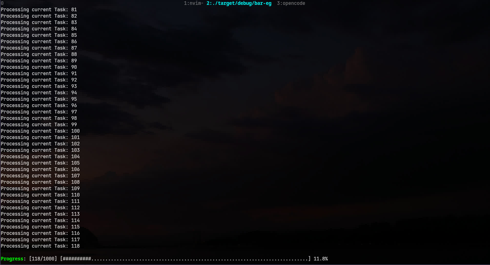

# Introduction #

A very simple progress bar to use in any project.

---- 
# Preview




---- 

# Quick start

Add 'spb' as dependency.

```bash
Cargo add spb

```
OR 

```bash
Cargo add --git https://github.com/BayonetArch/spb
```
# Example


```rust
use std::{thread, time::Duration};
use spb::{initial_bar_setup, restore_bar_setup};

fn main() {
    initial_bar_setup(); // initial setup for bar

    let total_task = 10;
    let mut current_task = 0;

    while current_task <= total_task {
        println!("Processing task: {}", current_task); 
        spb::progress_bar(total_task, current_task); // display the bar at bottom

        current_task+=1;
        thread::sleep(Duration::from_millis(100));
    }

    restore_bar_setup(); // restore everything
}
```

